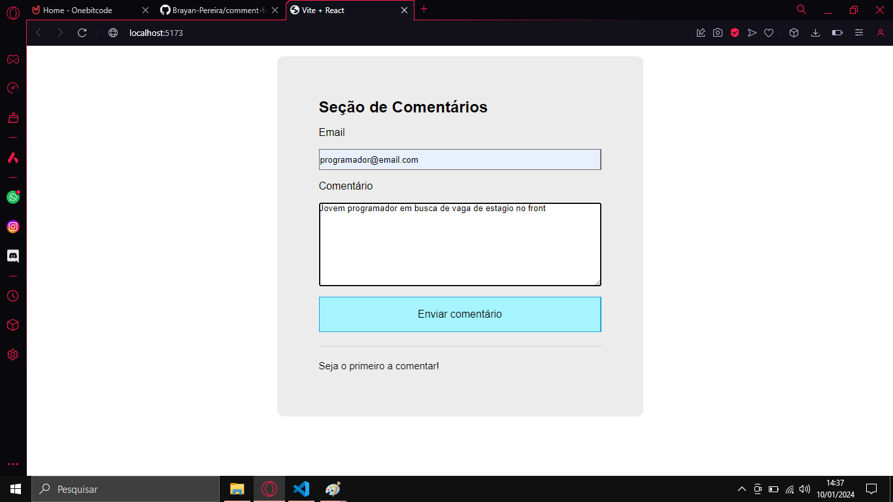
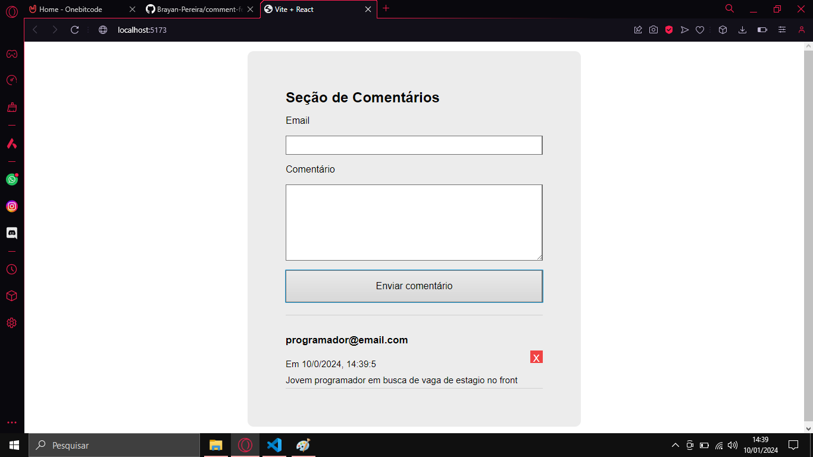
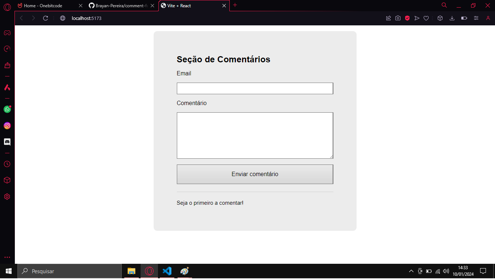

# Feed de Comentários - React.js

Exercicio do Curso
Basicamente uma aplicação react que possui 3 principais funções:

    - Informe formulario: Onde o usuario informa o email e o comentario
    
    - Adicionar comentário: Ao clicar no botão o comentário é adicionado
    
    - Remover comentário: Uma função extra que eu adicionei ao exercicio, acionada atráves de um botão presente nos componentes de comentário
    
    